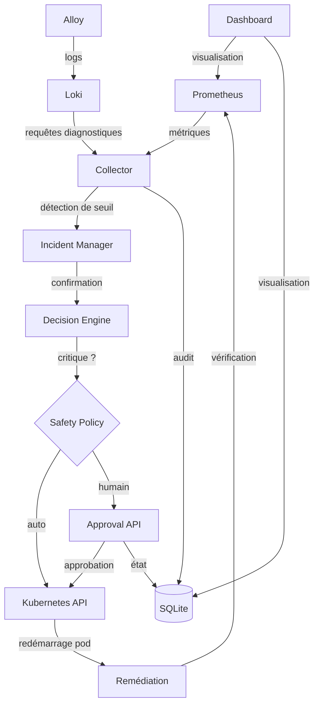

# 🤖 Agent DevOps Autonome — Infrastructure Auto-Réparatrice

     

> Pipeline de supervision, détection d'anomalies, diagnostic et remédiation automatique pour clusters Kubernetes — développé par **Smartovate Ltd**.

---

## 📖 Sommaire

- [Contexte et objectifs](#-contexte-et-objectifs)
- [Périmètre du projet](#-périmètre-du-projet)
- [Architecture](#-architecture)
- [Fonctionnalités](#-fonctionnalités)
- [Stack technique](#️-stack-technique)
- [Démarrage rapide](#-démarrage-rapide)
- [Configuration](#️-configuration)
- [Requêtes de supervision](#-requêtes-de-supervision)
- [Sécurité](#-sécurité)
- [Dépannage](#-dépannage)
- [Backlog fonctionnel](#-backlog-fonctionnel)
- [Risques identifiés et mesures correctives](#-risques-identifiés-et-mesures-correctives)
- [Livrables](#-livrables)
- [Planning](#-planning-prévisionnel)
- [Contribuer](#-contribuer)
- [Licence](#-licence)

---

## 🎯 Contexte et objectifs

Smartovate Ltd, entreprise spécialisée dans le conseil en cloud computing, gère des infrastructures complexes pour de multiples clients. La gestion des incidents, bien qu'en partie automatisée, nécessite encore une intervention humaine significative pour le diagnostic et la résolution des pannes courantes, entraînant des temps d'arrêt prolongés et mobilisant les équipes DevOps sur des tâches répétitives à faible valeur ajoutée.

L'**Agent DevOps Autonome** est un système intelligent capable de :

- surveiller l'infrastructure en continu,
- détecter les anomalies en temps réel,
- analyser les logs pour identifier la cause racine,
- exécuter des actions de remédiation de manière autonome (auto-réparation),
- ou escalader vers un humain lorsque la situation l'exige.

**Objectif chiffré :** réduire le *Mean Time To Recovery* (MTTR) de **40 %** sur les incidents de niveau 1 et 2, tout en offrant un tableau de bord permettant aux équipes de superviser les actions prises par l'agent.

---

## 📦 Périmètre du projet

### Inclus
- Agent de surveillance connecté aux outils de monitoring existants (Prometheus / Grafana).
- Moteur de règles / modèle léger pour l'analyse des logs et la prise de décision.
- Scripts de remédiation automatisés (redémarrage de pods Kubernetes, ajustement de l'autoscaling, libération d'espace disque).
- Interface de visualisation (dashboard) des incidents résolus et des actions en attente d'approbation.
- Déploiement sur environnement de test Kubernetes (K3s / Minikube).

### Exclus
- Gestion des incidents de sécurité complexes (SecOps).
- Déploiement en environnement de production client (limité au staging/test).
- Développement d'un système de monitoring from scratch (réutilisation des outils existants).

---

## 🧩 Architecture



| Composant | Rôle |
|---|---|
| **Prometheus** | Collecte des métriques (CPU, RAM, réseau) et alerting |
| **Loki + Alloy** | Agrégation et expédition des logs Kubernetes |
| **Collector** | Cœur de l'agent (Python) — détection, diagnostic, décision |
| **API** | Approbations manuelles et audit (REST) |
| **SQLite** | Persistance des incidents, approbations, journaux d'audit |
| **Kubernetes** | Cible de l'orchestration et de la remédiation |
| **Dashboard** | Supervision des interventions de l'agent |

---

## ✨ Fonctionnalités

- ✅ **Remédiation de bout en bout** — de l'alerte Prometheus au redémarrage du pod, jusqu'à la vérification post-action.
- ✅ **État persistant** — SQLite centralise incidents, approbations et journaux d'audit, partagés entre l'API et le collector.
- ✅ **Throttling intelligent** — évite la répétition d'incidents pour une même dérive soutenue (logique de cooldown).
- ✅ **Diagnostic Loki-first** — récupère les logs `ERROR`/`WARN`, avec repli sur une corrélation métrique si les logs sont indisponibles.
- ✅ **Sécurité à deux niveaux** — exécution automatique pour les incidents mineurs, approbation humaine obligatoire pour les actions critiques.
- ✅ **Base de connaissances extensible** — signatures pour les incidents CPU et mémoire haute, extensible à d'autres catégories (OOM, DiskFull, NetworkTimeout…).
- ✅ **Service collector dédié** — conteneur Docker indépendant pour une architecture modulaire.

---

## 🛠️ Stack technique

- **Langages :** Python (agent, analyse), Go *(optionnel, modules performants)*, Bash
- **Conteneurisation :** Docker, Docker Compose, Kubernetes (K3s / Minikube pour les tests)
- **Observabilité :** Prometheus, Grafana, Loki *(ou ELK Stack)*
- **CI/CD & Configuration :** GitLab CI, Terraform, Ansible
- **Gestion de projet :** Jira, Confluence, Git

---

## 🚀 Démarrage rapide

### 1. Récupérer le projet
Copier le contenu de ce dépôt dans votre projet existant. **Ne pas écraser** vos fichiers de dashboard ou de templates.

### 2. Définir le pod cible
Dans `docker-compose.yml` :

```yaml
environment:
  TARGET_POD: "my-app-pod"
  K8S_NAMESPACE: "default"
```

> Si omis, le collector sélectionne automatiquement le pod avec la plus forte consommation CPU, avec repli sur le premier pod `Running`.

### 3. Lancer la stack

```powershell
docker compose down
docker compose build --no-cache
docker compose up -d
```

### 4. Vérifier les logs

```powershell
docker compose ps
docker logs -f monitoring-collector
```

**Sortie attendue :**

```text
Target pod: my-app-pod
Confirmed incidents: 1
INCIDENT DETECTED
INCIDENT START
Loki query: {pod="my-app-pod"} |= "ERROR"
DECISION: AUTO_EXECUTE
REMEDIATION: kubectl delete pod my-app-pod
REMEDIATION END
outcome=resolved
```

**Pour un incident critique :**

```text
SUGGEST_TO_HUMAN
Human approval required for critical action
→ GET /api/approvals/pending
```

---

## ⚙️ Configuration

### Seuils (valeurs de démo)

| Métrique | Seuil | Durée |
|---|---|---|
| CPU | > 70 % | 60 s |
| Mémoire | > 70 % | 60 s |

> Après la démo, restaurer des valeurs de production (ex : CPU > 90 % pendant 300 s), conformément aux critères d'acceptation du backlog (US 1.2).

### Variables d'environnement

| Variable | Défaut | Description |
|---|---|---|
| `TARGET_POD` | *(auto-détection)* | Nom du pod à surveiller |
| `K8S_NAMESPACE` | `default` | Namespace Kubernetes |
| `PROMETHEUS_URL` | `http://prometheus:9090/api/v1/query` | Endpoint API Prometheus |
| `LOKI_URL` | `http://loki:3100` | URL de base Loki |
| `DRY_RUN` | `false` | `true` pour simuler la remédiation sans exécution réelle |
| `PROMETHEUS_REQUIRE_AUTH` | `false` | Désactiver pour les tests locaux |

---

## 📈 Requêtes de supervision

**1. Usage CPU (30 dernières minutes)**
```promql
avg(rate(container_cpu_usage_seconds_total{pod="my-app-pod"}[5m])) by (pod)
```

**2. Usage mémoire vs seuil**
```promql
container_memory_working_set_bytes{pod="my-app-pod"} / container_spec_memory_limit_bytes * 100
```

**3. Nombre d'incidents dans le temps**
```promql
increase(incidents_total[1h])
```

**4. Logs d'erreur (LogQL)**
```logql
{pod="my-app-pod"} |= "ERROR" | json | line_format "{{.message}}"
```

---

## 🔒 Sécurité

> ⚠️ **CRITIQUE :** si votre dépôt public contient un fichier `kube-docker-config.yaml` avec des certificats client et des clés privées embarqués, ce credential doit être considéré comme compromis.

**Actions requises :**
1. Générer un nouveau kubeconfig / credential.
2. Supprimer l'ancienne clé de l'historique Git (`git filter-repo` ou équivalent — une réécriture d'historique standard ne suffit pas).
3. Stocker le nouveau credential en tant que secret (Kubernetes Secret, Vault, etc.) ou dans un fichier local ignoré par Git.

### Test de connectivité

```bash
# Accès Kubernetes
docker exec monitoring-collector kubectl --kubeconfig /app/kube-config/config get pods -A

# Disponibilité Loki
docker exec monitoring-api python -c "import requests; print(requests.get('http://loki:3100/ready').text)"

# Disponibilité Prometheus
docker exec monitoring-collector python -c "import requests; print(requests.get('http://prometheus:9090/-/ready').text)"
```

---

## 🔧 Dépannage

| Symptôme | Cause probable | Solution |
|---|---|---|
| Logs collector : `check_metrics() not found` | Mauvais appel de fonction | Utiliser `check_and_confirm()` |
| Aucun incident déclenché | URL Prometheus sans `/api/v1/query` | Corriger `PROMETHEUS_URL` |
| Loki retourne vide | Alloy ne transmet pas les logs | Vérifier la config Alloy et la connectivité réseau |
| Le redémarrage du pod échoue | `DRY_RUN` actif ou permissions manquantes | Passer `DRY_RUN=false` et vérifier le RBAC |
| Alertes répétées toutes les 30s | Logique de cooldown absente | Doit être corrigé dans cette version |

---

## 📋 Backlog fonctionnel

### Epic 1 — Collecte de données et détection d'anomalies *(Sprint 1)*
- **US 1.1 — Connexion aux sources de monitoring** : authentification à l'API Prometheus, récupération CPU/RAM/réseau toutes les 30 s, journalisation des erreurs de connexion en `ERROR`.
- **US 1.2 — Détection des seuils critiques** : seuils configurables via YAML, génération d'un événement JSON incluant service, pod et valeur de métrique.

### Epic 2 — Diagnostic et analyse des logs *(Sprint 2)*
- **US 2.1 — Agrégation des logs contextuels** : récupération des 500 dernières lignes filtrées sur `WARN`/`ERROR`/`FATAL`, en moins de 5 secondes.
- **US 2.2 — Identification de la cause racine** : catégorisation de l'erreur (OutOfMemory, DiskFull, NetworkTimeout…) avec score de confiance ; escalade humaine si confiance < 80 %.

### Epic 3 — Remédiation automatisée *(Sprint 3)*
- **US 3.1 — Exécution de scripts d'auto-réparation** : commandes Kubernetes et playbooks Ansible, avec timeout strict (ex. 2 min).
- **US 3.2 — Vérification post-remédiation** : re-contrôle Prometheus après un délai configurable ; escalade Slack/Teams si le problème persiste.

### Epic 4 — Supervision et reporting *(Sprint 4)*
- **US 4.1 — Tableau de bord des interventions** : incidents détectés/résolus/escaladés, historique horodaté, accès web sécurisé.
- **US 4.2 — Mode d'approbation manuelle (Dry-Run)** : notification Slack/Email avec boutons Approuver/Rejeter ; exécution conditionnée à l'approbation.

---

## ⚠️ Risques identifiés et mesures correctives

| # | Risque | Impact | Mesure corrective |
|---|---|---|---|
| 1 | **Boucle de redémarrage infinie** (CrashLoopBackOff) sur une mauvaise configuration | Surcharge de l'API Kubernetes | Rate limiting par pod : arrêt des tentatives automatiques après 3 redémarrages en 15 min, puis escalade humaine |
| 2 | **Faux positifs lors de pics de charge légitimes** (ex. campagne marketing) | Interruption de service injustifiée | Analyse de tendance (comparaison historique) et fenêtres de maintenance configurables mettant l'agent en pause |
| 3 | **Perte de connexion à l'API Kubernetes** | Erreurs en cascade, remédiation impossible | Retry exponentiel (backoff) ; alerte « Agent Offline » via canal secondaire si la perte dépasse 5 minutes |

---

## 📦 Livrables

- Code source de l'Agent DevOps Autonome, documenté et versionné.
- Scripts de remédiation (playbooks Ansible / scripts Python-Bash).
- Fichiers de configuration Kubernetes (manifests / charts Helm).
- Tableau de bord de supervision (Grafana ou application web légère).
- Documentation technique et guide d'utilisation.

---

## 🗓️ Planning prévisionnel

| Sprint | Période |
|---|---|
| Sprint 1 (S1–S2) | 1 – 14 juillet 2026 |
| Sprint 2 (S3–S4) | 15 – 28 juillet 2026 |
| Sprint 3 (S5–S6) | 29 juillet – 11 août 2026 |
| Sprint 4 (S7–S8) | 12 – 25 août 2026 |

---

## 🙌 Contribuer

Les pull requests sont les bienvenues. Pour tout changement majeur, merci d'ouvrir une issue au préalable afin de discuter de ce que vous souhaitez modifier.

---

## 📄 Licence

MIT — voir le fichier `LICENSE` pour plus de détails.

---

*Auto-healing, en toute autonomie. 🚀*
